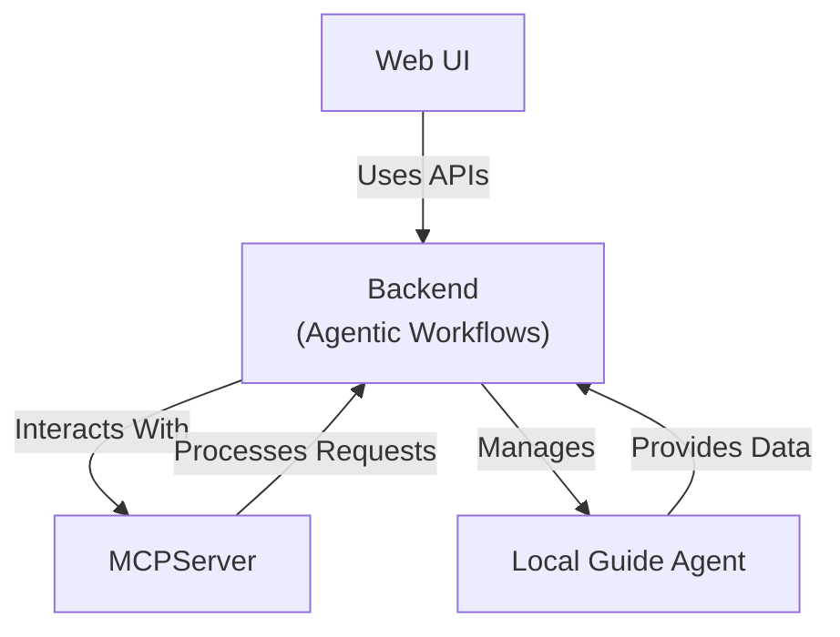

# Accede Travel Concierge

**Disclaimer: This sample is for demonstration purposes only and is not intended for production use. It may not include all the features or safeguards needed for a production environment.**

## Introduction

Accede Travel Concierge is a modular application designed to streamline travel planning and expense management. The project is structured into three main components:

## Project Structure



### .NET Projects

- **`AccedeSimple.AppHost/`**: Serves as the entry point and host for the application, managing configuration and startup logic.
- **`AccedeSimple.Service/`**: Implements the core business logic and service layer, handling travel planning, approvals, and expense processing.
- **`AccedeSimple.ServiceDefaults/`**: Provides default implementations and shared utilities to support the service layer.
- **`AccedeSimple.Domain/`**: Contains domain models and logic for features such as approvals, bookings, expenses, trips, and shared utilities.
- **`AccedeSimple.MCPServer/`**: Implements the MCP server functionality for extended capabilities.

### Other Projects

- **`webui/`**: React web application for the user interface.
  - **`src/components/`**: Contains React components like `AdminPage`, `ChatContainer`, and `VirtualizedChatList`.
  - **`src/services/`**: Includes service files like `AdminService.ts` and `ChatService.ts`.
  - **`src/styles/`**: Contains CSS files for styling various components.
  - **`src/types/`**: TypeScript type definitions for the application.
- **`localguide/`**: FastAPI Web API for retrieving city attractions using an AI agent.
  - **`Dockerfile`**: Configuration for containerizing the API.
  - **`main.py`**: Entry point for the FastAPI application.
  - **`pyproject.toml`**: Python project configuration.

## Prerequisites

To run the application, ensure the following tools and frameworks are installed:

- [.NET 9 SDK or greater](https://dotnet.microsoft.com/download)
- [Aspire CLI](https://learn.microsoft.com/en-us/dotnet/aspire/cli/install?tabs=unix#install-as-a-native-executable)
- [Python 3.12 or greater](https://www.python.org/downloads/)
- [UV](https://docs.astral.sh/uv/)
- [Visual Studio Code](https://code.visualstudio.com/)
- [Azure Developer CLI](https://learn.microsoft.com/azure/developer/azure-developer-cli/install-azd?tabs=winget-windows%2Cbrew-mac%2Cscript-linux&pivots=os-windows) (if applicable)

## Quick Start

1. **Clone the repository**:

   ```bash
   git clone https://github.com/your-repo/AccedeSimple.git
   cd AccedeSimple
   ```

### Running the app

1. **Run the application**:

   Start the application using the .NET CLI:
   ```bash
   aspire run
   ```

Open the Aspire dashboard and enter your Azure Subscription ID to deploy the AI models.

You're now ready to use the Accede Travel Concierge application!

## Deployment

Follow the standard [deployment guidance for Aspire](https://learn.microsoft.com/dotnet/aspire/deployment/azure/aca-deployment)

1. In the Aspire AppHost's directory, run the following command

   ```bash
   azd init
   ```

1. Deploy the app

   ```bash
   azd up
   ```